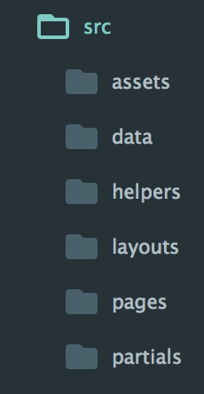

# Inky Substratum
> A mordern way to create beautiful, reusable HTML email templates using the Zurb Foundation framework with PUG syntax.

[](https://david-dm.org/zurb/foundation-emails-template#info=Dependencies)
[](https://david-dm.org/zurb/foundation-emails-template#info=devDependencies)

**Please open all issues with this template on the main [Foundation for Emails](http://github.com/zurb/foundation-emails/issues) repo.**


This is the official starter project for [Foundation for Emails](http://foundation.zurb.com/emails), a framework for creating responsive HTML devices that work in any email client. It has a Gulp-powered build system with these features:

- Handlebars HTML templates with [Panini](http://github.com/zurb/panini)
- Simplified HTML email syntax with [Inky](http://github.com/zurb/inky)
- [Pug Syntax](https://pugjs.org/api/reference.html)
- Sass compilation
- Image compression
- Built-in BrowserSync server
- Full email inlining process
- Upload to S3 bucket
- Send emails from local nodemailer


## Dependencies
- [Node.js](https://nodejs.org/en/)  7.0+

## Optional Dependencies
- [Mailgun Account](https://www.mailgun.com/)
- [AWS S3 Bucket](http://aws.amazon.com)


## Getting Started

### Manual Setup

1. Clone this template
2. Replace .git file with your own blank git project `cd template_dir && rm -rf .git && git init`
3. Install dependencies `yarn || npm i`
4. Duplicate `config-example.json`
5. Add `config.json` credentials and **meta data**
6. Start development `yarn start || npm start`

### Upgrading an older project
As long as you're using v1.0.0 of this project all you have to do is delete your `node_modules` + copy and replace:

- `gulpfile.babel.js`
- `package.json`
- Edit config meta
- run `yarn install` + Enjoy!


### Commands

>**Note:** Ensure you change the job meta in the config.json file before running `send` or `upload` commands. See **Config** section below.

Command line  | Description
---|---
`yarn` | Use yarn to install dependencies
`yarn start` | Runs watch task development build without inlining
`yarn build` | Runs watch task with inlined CSS - **Note:** Preferred method, as it will show accurately the hierarchy of CSS
`yarn zip` | Runs `build` script and then zips all your code/images, if you have multiple `HTML` files then it will create a `[name].zip` for each file with `/assets/` included. Useful for packaging up templates for [Mailchimp](https://mailchimp.com/) or [Campaign Monitor](https://www.campaignmonitor.com/).
`yarn upload` | Runs `build` script and then uploads all your code/images
`yarn send` | Runs `build` and `upload` script then prompts which template and email list to send


## Config

> `config-example.json` is attached to this project

Duplicate this file and rename it to `config.json`

### Meta
>**Important:** Meta NEEDS to be changed between projects, everything else at large can stay the same

```json
# Change!!!
{
  "meta": {
    "year": 2017,
    "client": "my-client", <!-- Change Client Name -->
    "job": "my-clients-job" <!-- Change job name or risk overriding what's there -->
  }
}
```

### AWS

```json
"aws": {
 
	// Enter your credentials here
    "region": "us-east-1",
    "accessKeyId": "YOUR_ACCOUNT_KEY",
    "secretAccessKey": "YOUR_ACCOUNT_SECRET",
    "params": {
        "Bucket": "THIS_IS_JUST_AN_EXAMPLE"
    },
    
    // This url is used in the `link` process
    "url": "http://s3-url-or-site-url-if-s3-hosting-is-on.com"
},

```

### Email Lists
>Set up your own test lists with as many or as few emails comma delimitered. This feature requires a [Mailgun account](https://www.mailgun.com/).

```json
"testing": {
	"from": "Test EDM <my-name@my-domain.com.au>",
	"lists": {
	  "test": "myaccount.runme.spam@previews.emailonacid.com",
	  "your-custom-list": "my-name@my-domain.com.au"
	}
}
```

**NOTE:** Using DKIM on your domain that your sending emails from in the `testing.from` to other users will mean your emails are less likely to end up in the Spam or Junk filters.


## Development

All templating files in development use PUG for the structure, be aware of indenting issues that may occur if you're new to PUG. Normal HTML can be used in PUG, however I would recommend writing it all PUG to save confusion.

### File Structure



Folder | Notes
---|---
`/assets` | Contains SASS, /img and /fonts assets. In the `/assets/scss/entities` folder, all the default Inky variables can be found in `/assets/scss/entities/_settings.scss`. **DO NOT EDIT THIS FILE**. Override variables in `/assets/scss/entities/_custom-settings.scss`.
`/data` | Panini values in JSON format, reference throught out your code as `{{fileName.key}}` where `fileName` is your json file eg. `data.json` and `key` is your json data eg. `{ colorBlack: #000 }`. Usage `{{data.colorBlack}}` will output `#000`
`/helpers` | Write custom handlebars helpers for extra logic. [Example Handlebars helpers can be found here.](https://github.com/helpers/handlebars-helpers)
`/layouts` | Will always use `default.pug`, define layouts to inject your `pages` code into.
`/pages` | Define as many pages you want to compile, these will directly output as `myPageName.html` in the root of the `/dist` folder. Eg. `index.pug, edm-v2.pug, edm-v3.pug` will output as `index.html, edm-v2.html, edm-v3.html`
`/partials` | Define your partials to import into your pages/layouts to save time, good for commonly used headers, footers or 'view in browser' areas


### Upload Troubleshooting
After editing the `config.json` simply run `npm run upload`, this will compile your code and upload to AWS.

#### AWS Cache
If you run into caching issues where you get an AWS 404 error, delete the hidden file `.awspublish-my-aws-bucket.com.au`, and re-run the command. This will force the client to re-read the directory and skip/upload your new files.

### Send Troubleshooting
To define recipients for your test email, edit/add your list in the `config.json` file. 

Run `npm run send` which will recompile your code, upload to AWS and prompt which email to send and which list to send it to.

> Sometimes the network will timeout, if so, run the command again. It will generally work 9/10 times.


## Testing
1. `yarn send`
2. Select template
3. Select list `your-list`

Majority of testing is done through [Email on Acid](emailonacid.com) and our testers. Before getting our testers involved, please check for silly little things that happen in Outlook and OSX Mail and resolve those first.


### Known Issues

#### Outlook
**Images breaking the layout**
All images for desktop require an html `width` attribute to be applied inline. If you define a class name to the image, and define a width in your SCSS this will be inlined in the gulp build process.
eg.

```css
.header-image {
	width: 600px;
	max-width: 600px; /* only required for Mailchimp variable content */

	@media screen and (max-width: $global-breakpoint) {
		width: 100% !important;
		max-width: 100% !important; /* only required for Mailchimp variable content */
	}
}

```
**Padding / Spacing**
When in doubt, use the Inky spacer mixin. If not and you need to pad out content, use the pug mixin `+able` and create a nested table. **DO NOT** override the spacing of inky's columns structure unless you know what you're doing. 

eg. Safest way to implement cross-client padding and spacing

```jade
// Method 1
// Nest table from _pug-mixins.pug

//- do not touch padding
columns(small="12)
	+able
		tr
			//- pad this instead
			td.padding-class.
				Padded content
	
		
// Method 2 - Vertical only
// Inky spacer mixin
spacer(size="30")

// Method 2 with mobile override
// See _helpers.scss
spacer(size="30").small-size-20

```

### Yahoo App iOS/Android
I've made a ticket, hopefully they'll fix this sooner rather than later. You can track how this issue is going on Foundations emails here: [https://github.com/zurb/foundation-emails/issues/810
](https://github.com/zurb/foundation-emails/issues/810)

A helper class has been added to `_helpers.scss` that deals with this awful spacing issue in Yahoo where the whole layout breaks.

What this does is kill all left and right padding for columns. If you need to add padding to this on mobile you'll need to nest a table which has mobile/yahoo specific padding (ugh).


```css
//
// Hacky yahoo mail responsive hack
// NOTE: Use with testing
// ------------------------------ //

@media yahoo {
    td.large-12.last, th.large-12.last,
    td.large-12.first, th.large-12.first,
    table.body .column, table.body .columns {
        padding-left: 0 !important;
        padding-right: 0 !important;    
    }
}
```

Re-add mobile padding for yahoo mail OSX but not yahoo mail desktop

```jade
+able
    tr
        td.content-padding.yahoo-padding                 
```

```css       
.yahoo-padding {
	/* mobile padding */
	@media yahoo {
		padding-left: $global-gutter !important;
		padding-right: $global-gutter !important;
	}
	&.content-image-container {
		/* desktop padding */
		@media screen and (min-width: $global-breakpoint) {
			padding-right: 0 !important;

			.content-image {
				width: 100% !important;
			}
		}
	}
}
```


## Changelog
	3/11/17 v1.0
	- Readme update
	- Generic example template added

	20/7/17 v0.3
	- Yarn now the preferred package manager
	- Overhaul example project in repo
	- Combining latest techniques from other projects to fix Yahoo or outlook issues
	- Massive readme update

	21/6/17 v0.2
	- Added S3 bucket upload functionality
	- Added Nodemailer for local sending
	
	16/6/17 v0.1
	- Started changelog
	- foundation-emails updated to develop branch to resolve current issues in template
	- package.json dependencies updated to v7 of node
	- removed prettify


## Contributors
* Clifford Gurney - [cliff@cliff.design](mailto:cliff@cliff.design)


### Footnotes
* This is not an active project, but I'm very happy to look at pull requests and take on requests for improvements or features.
* **Known issues** are not always reviewed and could be fixed in later versions of Inky, but they are there for reference anyway if you get stuck.
